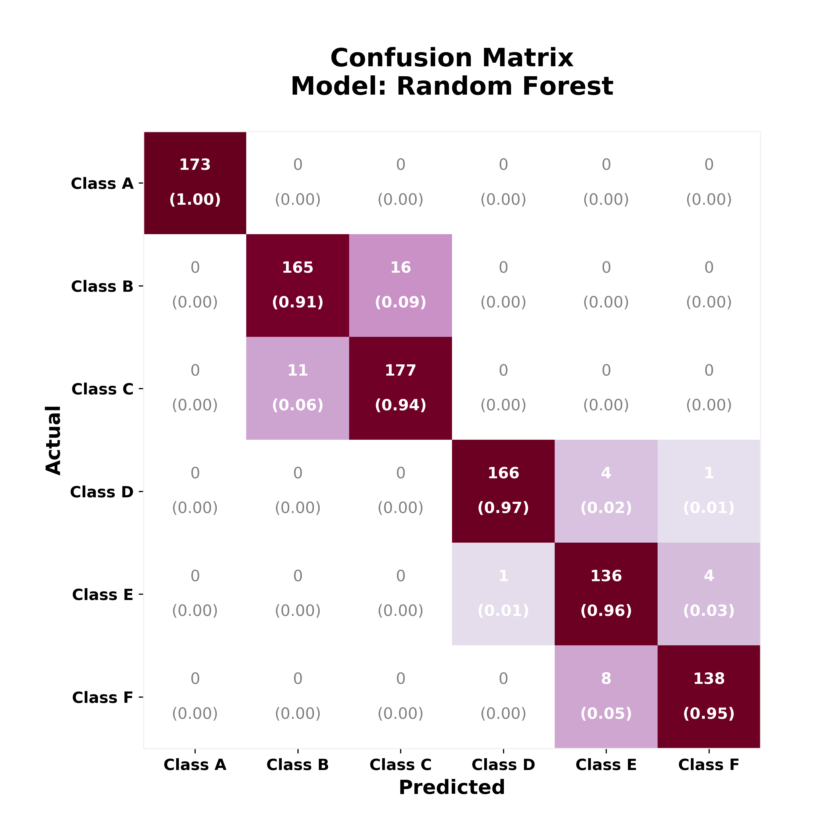
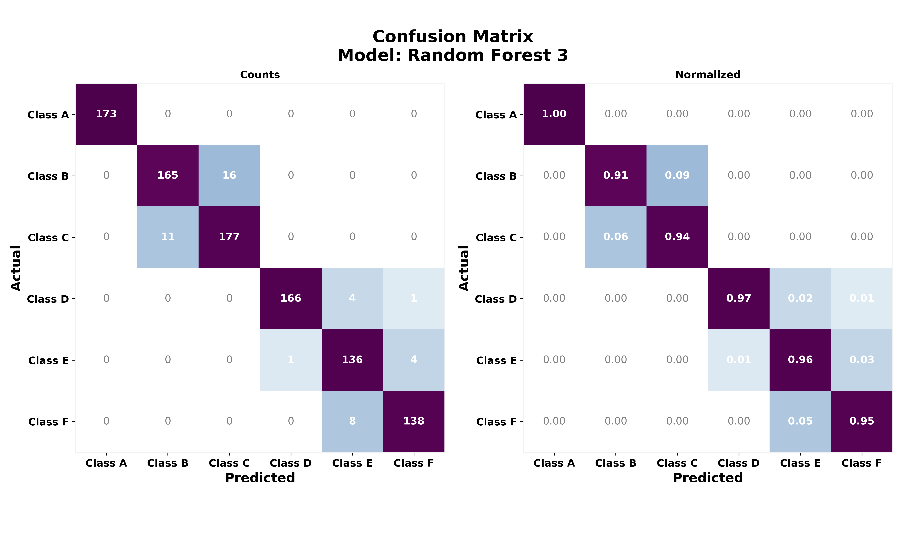

<br>

# Confusion Matrix Heatmaps


#### Python scrypt with functions to produce Confusion Matrix Heatmaps using matplotlib


The main function:
```
heated_confusion_matrix(cm, labels, annotation = "both", cmap = plt.cm.Reds, 
            contrast = 4, model_name = None, by_side = False, save_fig = False):

```
Contains options to:

- Annotate the confusion matrix with "absolute" counts, 
"normalized", or "both" (default).
- Plot absolute and normalized type of matrices side by side.
- Choose the colormap and adjust color contrast. 

#### Contents:

- [cm_heat_plots.py](cm_heat_plots.py): A Python script with functions to plot the confusion matrices
- [media](media): Contains some sample output images
- [README.md](README.md): This File  

<br>

**Example with `annotation = "both"`**
<p align="center">

</p>
<br>

**Example with `by_side = True`**
<p align="center">

</p>
<br>
<hr>
<br>
